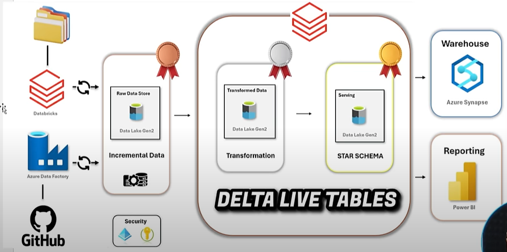

# 📊 Netflix Data Engineering Project

A modern data engineering pipeline leveraging Azure Data Factory, Azure Data Lake Storage (ADLS), and Databricks to ingest, transform, and serve Netflix dataset layers using Delta Live Tables (DLT) and Unity Catalog.

---

## 🧱 Architecture Overview



---

## 🚀 End-to-End Data Flow

### 🔹 Bronze Layer - Raw Ingestion
- **4 datasets** (director, cast, category, etc.) are fetched from **GitHub** via **Azure Data Factory (ADF)** and stored in the **bronze layer** of ADLS Gen2.
- A pre-existing **Netflix master file (`netflix_titles.csv`)** resides in the **raw** folder.

### 🔸 Bronze Autoloader with Unity Catalog
- **Databricks Autoloader** is set up with **Unity Catalog** to ingest data **incrementally** from the `raw` folder to the `bronze` layer.
- Schema evolution and governance are managed using Unity Catalog.

### 🥈 Silver Layer - Cleaned and Joined Data
- All datasets in bronze are transformed and cleaned in **Databricks notebooks** and written into **silver** layer tables.

### 🥇 Gold Layer - Delta Live Tables
- **Delta Live Tables (DLT)** read from silver.
- Perform basic transformations, generate a **star schema**, and save clean Delta tables into the **gold layer**.

---

## 🧩 Tech Stack

| Layer           | Technology                  |
|----------------|-----------------------------|
| Orchestration  | Azure Data Factory (ADF)     |
| Storage        | Azure Data Lake Gen2         |
| Processing     | Azure Databricks             |
| Ingestion      | Autoloader                   |
| Governance     | Unity Catalog                |
| Transformation | Delta Live Tables (DLT)      |
| Reporting      | Power BI (planned)           |

---

## 📂 Repository Structure

```bash
.
├── adf-netflix1895/                 # ADF ARM templates for datasets, pipelines, linked services
├── ad-pipelines/                    # Databricks notebooks for transformation
├── databricks-notebooks/            # Job definition exports from Databricks
├── images/                          # Architecture diagrams and related docs
├── data/                            # Sample or mock Netflix data
└── README.md                        # This file
```

---

## 📁 ADLS Folder Layout

```bash
/adls/
├── raw/                  # Original master data (e.g., netflix_titles.csv)
├── bronze/               # Ingested raw datasets (cast, director, etc.)
├── silver/               # Cleaned, structured, and joined data
├── gold/                 # Star schema data transformed via DLT
```

---

## 🛠️ Setup Instructions

### Prerequisites
- Azure Subscription (with ADF, ADLS, Databricks)
- Databricks workspace with Unity Catalog enabled
- GitHub repository for version control

### Setup Steps

1. **Clone the Repository**
```bash
git clone https://github.com/ashish18oct/Netflix-Data-Engineering.git
```

2. **Configure Databricks CLI**
```bash
databricks configure --token
```

3. **Deploy ADF Pipelines**
   - Import from `/adf-netflix1895/` using ARM template deployment or manually.

4. **Upload Notebooks**
   - Import from `/databricks-notebooks/` into your Databricks workspace.

5. **Configure and Run Autoloader + DLT**
   - Set up autoloader to ingest data from ADLS raw to bronze.
   - Configure DLT pipeline from silver to gold.

---

## 🔐 Security & Access Control

- **Unity Catalog** enforces table-level permissions and access policies.

---

## 🧠 Lessons Learned

- Hands-on with Unity Catalog for data governance
- Efficient ingestion using Databricks Autoloader
- Implemented a modular medallion architecture with DLT

---

## 🙌 Acknowledgements

- Netflix open dataset (for demonstration purposes)
- Azure & Databricks documentation
